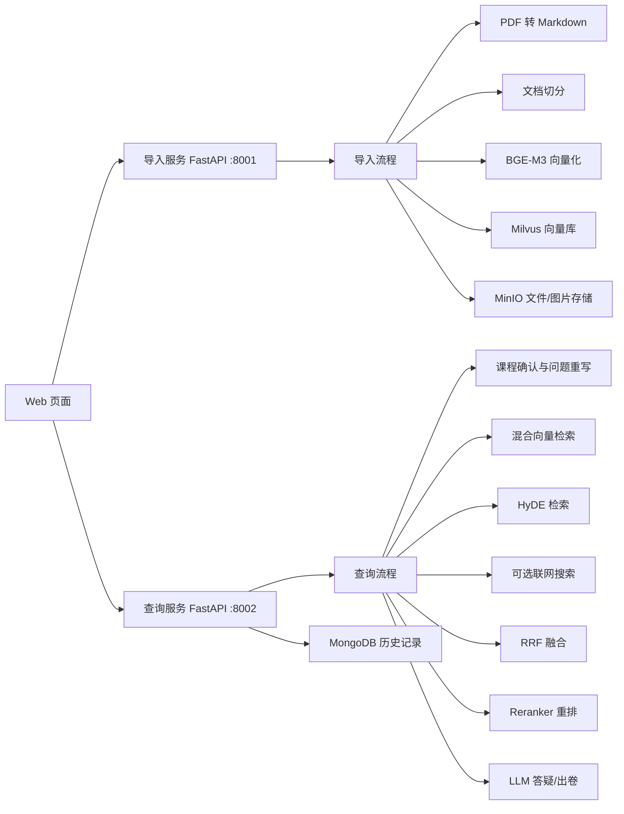

# DataSet_RAG 专业课助教

DataSet_RAG 是一个面向大学专业课学习的 RAG 知识库助手。你可以为每一门课程建立独立知识库，导入教材 PDF、课件、往年期中期末试卷、作业习题等资料，然后在网页端进行课程答疑、图片/文件解析、历史对话追问，以及基于往年试卷风格生成模拟试卷。

项目当前包含两套 FastAPI 服务：

- 导入服务 `:8001`：负责课程创建、资料上传、PDF/Markdown 解析、文档切分、向量化和入库。
- 查询服务 `:8002`：负责课程问答、知识库检索、图片/附件解析、流式回答、历史记录和模拟出卷。

## 核心功能

- 课程隔离：每门课拥有独立的 `course_id`，导入、检索和历史对话都按课程隔离。
- 多类型资料导入：支持教材、课件、往年试卷、作业习题和其他资料类型。
- PDF/Markdown 入库：PDF 会先转 Markdown，再进行图片处理、切分、向量化和入库。
- 混合检索：使用 BGE-M3 生成 dense/sparse 向量，在 Milvus 中进行混合召回。
- HyDE 检索：查询侧会生成假设性文档辅助召回，提高复杂问题命中率。
- RRF 融合与重排序：融合多路召回结果，并使用 reranker 重新排序。
- 专业课答疑：根据当前课程知识库和历史会话回答问题。
- 模拟试卷生成：出卷模式会优先参考导入的往年试卷结构和题型，例如保持相近的大题数量、题型分布和考点方向。
- 出卷结构分析：生成试卷前会先对往年试卷切片做确定性结构统计，提取常见大题数量、题型、分值和高频考点，再将分析结果注入出卷 Prompt。
- 多模态输入：查询页支持点击上传、拖拽上传、粘贴截图/图片/文件，并将附件解析结果加入本轮回答上下文。
- 流式输出：查询页使用 SSE 流式展示生成过程，最终答案再进行 Markdown 与公式渲染。
- 历史记录：对话历史保存到 MongoDB，并按课程加载。

## 技术架构



## 目录结构

```text
app/
  clients/                 # Milvus、MongoDB、MinIO、课程配置等客户端工具
  conf/                    # 环境变量配置读取
  core/                    # 日志、Prompt 加载
  import_process/
    api/                   # 导入服务 API
    agent/                 # 导入流程节点
    page/import.html       # 导入/新建课程页面
  query_process/
    api/                   # 查询服务 API
    agent/                 # 查询流程节点
    page/chat.html         # 课程问答页面
    utils/                 # 查询侧附件解析工具
  lm/                      # LLM、Embedding、Reranker 工具
  utils/                   # 通用任务状态、SSE 等工具
prompts/                   # 答疑、问题重写、出卷等提示词
output/                    # 运行产物，已忽略提交
volumes/                   # 本地服务数据目录，已忽略提交
```

课程列表默认保存在：

```text
output/courses.json
```

## 环境依赖

项目使用 Python 3.12，推荐使用 `uv` 管理依赖。

需要准备以下服务或模型配置：

- MongoDB：保存课程对话历史。
- Milvus：保存知识库切片向量。
- MinIO：保存上传文件和图片资源。
- OpenAI 兼容的大模型接口：用于问题重写、答案生成、图片理解等。
- BGE-M3：用于知识库向量化。
- BGE Reranker：用于候选文档重排序。
- MinerU：用于 PDF 解析。

## 环境变量

在项目根目录创建 `.env` 文件。不要提交真实密钥。

```env
# PDF 解析
MINERU_API_TOKEN=
MINERU_BASE_URL=

# LLM
OPENAI_API_KEY=
OPENAI_BASE_URL=
LLM_DEFAULT_MODEL=
VL_MODEL=qwen-vl-max
LLM_DEFAULT_TEMPERATURE=0.1

# MinIO
MINIO_ENDPOINT=http://127.0.0.1:9000
MINIO_ACCESS_KEY=minioadmin
MINIO_SECRET_KEY=minioadmin
MINIO_BUCKET_NAME=knowledge-base-files
MINIO_IMG_DIR=/upload-images

# Embedding
BGE_M3_PATH=
BGE_M3=BAAI/bge-m3
BGE_DEVICE=cpu
BGE_FP16=0

# Milvus
MILVUS_URL=localhost:19530
CHUNKS_COLLECTION=kb_chunks
ENTITY_NAME_COLLECTION=kb_graph_entity_names
ITEM_NAME_COLLECTION=kb_item_names

# MongoDB
MONGO_URL=mongodb://localhost:27017
MONGO_DB_NAME=query

# 联网搜索 MCP，可选
MCP_DASHSCOPE_BASE_URL=

# Reranker
BGE_RERANKER_LARGE=
BGE_RERANKER_DEVICE=cpu
BGE_RERANKER_FP16=0
```

## 安装

```powershell
uv sync
```

也可以使用普通虚拟环境：

```powershell
python -m venv .venv
.\.venv\Scripts\activate
pip install -e .
```

复制环境变量模板：

```powershell
copy .env.example .env
```

然后按本机服务地址、模型名称和密钥补全 `.env`。

## 健康检查

运行基础环境检查：

```powershell
uv run python scripts/health_check.py
```

如果导入服务和查询服务已经启动，也可以检查 HTTP 接口：

```powershell
uv run python scripts/health_check.py --services
```

## 启动

Windows 下一键启动两个 FastAPI 服务：

```powershell
powershell -ExecutionPolicy Bypass -File scripts/dev_start.ps1
```

如果只想启动服务、不运行健康检查：

```powershell
powershell -ExecutionPolicy Bypass -File scripts/dev_start.ps1 -SkipCheck
```

启动导入服务：

```powershell
uv run python app/import_process/api/import_server.py
```

导入页面：

```text
http://127.0.0.1:8001/import.html
```

启动查询服务：

```powershell
uv run python app/query_process/api/query_server.py
```

问答页面：

```text
http://127.0.0.1:8002/chat.html
```

页面之间可以互相跳转：问答页点击“新建课程”进入导入页，导入页点击“返回问答”回到问答页。

## 使用流程

1. 启动 MongoDB、Milvus、MinIO 和模型相关服务。
2. 启动导入服务和查询服务。
3. 打开 `http://127.0.0.1:8001/import.html`。
4. 新建或选择课程。
5. 选择资料类型，例如教材、课件、往年试卷、作业习题。
6. 上传 PDF 或 Markdown 文件，等待导入任务完成。
7. 打开 `http://127.0.0.1:8002/chat.html`。
8. 选择课程，在“答疑”模式提问，或在“出卷”模式生成模拟试卷。
9. 查询页也可以直接粘贴/拖入图片或文件，让助手结合附件内容回答。

## 常用接口

导入服务：

```text
GET  /import.html
GET  /courses
POST /courses
POST /upload
GET  /status/{task_id}
```

查询服务：

```text
GET    /chat.html
GET    /health
GET    /courses
POST   /query
POST   /query_with_files
GET    /stream/{session_id}
GET    /history/{session_id}
DELETE /history/{session_id}
```

普通问答请求示例：

```json
{
  "query": "帮我解释一下牛顿插值公式",
  "session_id": "optional-session-id",
  "is_stream": true,
  "course_id": "计算方法",
  "course_name": "计算方法",
  "mode": "qa"
}
```

出卷请求示例：

```json
{
  "query": "帮我出一份今年计算方法的期末模拟试卷",
  "session_id": "optional-session-id",
  "is_stream": true,
  "course_id": "计算方法",
  "course_name": "计算方法",
  "mode": "exam"
}
```

## RAG 效果评测

项目提供 `evals/` 下的评测脚本，用于从功能测试升级到 RAG 效果测试。

示例资料目录：

```text
evals/sample_docs/
```

导入示例 PDF 到“计算方法”课程：

```powershell
uv run python evals/import_sample_docs.py --course-name 计算方法
```

运行 RAG 链路评测样本，保存答案、上下文和每步中间结果：

```powershell
uv run python evals/run_rag_eval.py
```

运行自定义链路指标：

```powershell
uv run python evals/custom_metrics.py
```

运行 Ragas 指标：

```powershell
uv run python evals/ragas_eval.py
```

汇总所有评测结果，生成整体报告：

```powershell
uv run python evals/summarize_eval.py
```

默认输出：

```text
evals/reports/rag_outputs.jsonl
evals/reports/custom_metrics.json
evals/reports/ragas_report.csv
evals/reports/eval_summary.json
evals/reports/eval_summary.md
```

主要关注：

- `faithfulness`：答案是否忠实于检索上下文。
- `answer_relevancy`：答案是否回答了用户问题。
- `context_precision`：TopK 上下文是否有用。
- `context_recall`：参考答案需要的信息是否被召回。
- `expected_material_hit_at_5`：前 5 个重排结果是否命中预期资料类型。
- `course_leak_rate`：是否检索到其他课程资料。
- `exam_context_ratio`：出卷相关问题中，试卷资料占上下文比例。

## 数据隔离

课程隔离依赖 `course_id`：

- 导入时，切片会写入 `course_id`、`course_name`、`material_type` 等字段。
- 查询时，Milvus 检索会使用当前课程过滤条件。
- 历史记录会保存课程字段，聊天页按课程加载历史。

如果 Milvus 中已有旧数据但没有 `course_id` 字段，新课程检索通常不会命中这些旧数据。建议按课程重新导入资料。

## 常见问题

### 页面显示 API 未连接

确认对应服务是否启动：

- 导入页需要 `8001` 服务。
- 问答页需要 `8002` 服务。

### 上传成功但查询不到内容

检查：

- 导入任务是否完成。
- Milvus 是否启动。
- `CHUNKS_COLLECTION` 配置是否正确。
- 问答页选择的课程是否和导入页一致。
- 数据是否缺少 `course_id`。

### 前端流式回答卡顿

查询页已做轻量流式预览，最终答案到达后才渲染 Markdown 和公式。如果浏览器仍卡顿，可以临时关闭“流式输出”。

### 图片或截图解析失败

检查：

- `VL_MODEL` 是否是账号可用的视觉模型。
- 图片是否过大或不清晰。
- `OPENAI_BASE_URL` 和 `OPENAI_API_KEY` 是否可用。

### 出卷效果不稳定

出卷质量依赖导入资料质量。建议每门课导入：

- 近 3-5 年期末试卷。
- 期中试卷。
- 习题课资料。
- 老师给出的复习范围。
- 平时作业和重点章节课件。

## 开发提示

- 新增资料类型时，需要同步前端 `material_type`、入库字段和出卷 Prompt。
- 如果希望考试预测更稳定，可以继续扩展 `app/query_process/utils/exam_structure_analyzer.py`，提取年份、分值、题型顺序、章节考频等更细结构。
- 如果希望部署更省心，可以把 MongoDB、Milvus、MinIO 编排到 Docker Compose，并让 `scripts/health_check.py` 检查容器状态。
- 如果需要多用户系统，可以将 `output/courses.json` 迁移到 MongoDB，并在 Milvus、MongoDB、MinIO 路径中增加 `user_id`。

## 许可证

当前仓库未声明许可证。如需开源发布，请先补充 LICENSE。
